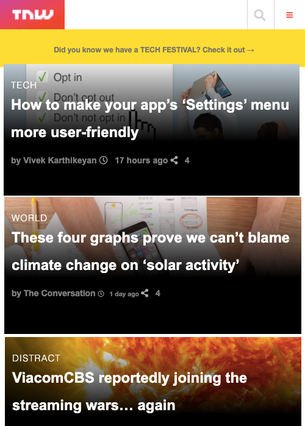

# Responsive-Design-The-Next-Web

Response Design- The Next Web
  
# What it does  
  
It is a responsive clone of The Next Web (https://thenextweb.com/). Users are able to view the page using different screen sizes. 
  
## Screenshot

## Built With  
  
- HTML
- CSS
- Font Awesome

  
## Live Project  

[The Next Web](https://kind-bhaskara-e0bd5c.netlify.com/)  

## Getting Article Started  
You may use the following steps to get a local copy:
  
Clone project to your local machine  
cd to the project directory  
Open project in IDE  
Open Live Preview through IDE or use localhost to view the project in your browser  
  
## 🤝 Contributing
You are welcome to make contributions to the repository. Contributions may be made through issues comments and feature requests.

## 👤 Authors

# Mupa M'mbetsa

- Github: [@mupa1](https://github.com/Mupa1)
- Twitter: [@mupa_mmbetsa](https://twitter.com/mupa_mmbetsa)
- Linkedin: [mupa](https://www.linkedin.com/in/mupa_mmbetsa)

# Calvin
- GitHub [here](https://github.com/calvinoea/)
- Twitter: [@yasukeoz](https://twitter.com/yasukeoz)
- LinkedIn: [Calvin](https://www.linkedin.com/in/calvin-ebun-amu-9b200017a/)

## Show your support  
Give a ⭐️ if you like this project!

## 📝 License  
This project is MiT licensed.

The project has been carried out using HTML, CSS, Stickler, and HTML validation. 

